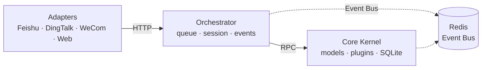

<div align="center">


# Nexus Lark Mind

**A personal, loosely coupled, layered AI agent orchestration platform.**

**English** | [简体中文](README.zh-CN.md)

[](https://github.com/Dthurt/Nexus_lark_mind)
[](LICENSE)
[](https://github.com/Dthurt/Nexus_lark_mind/stargazers)
[](https://www.python.org/)
[](https://react.dev/)
[](https://fastapi.tiangolo.com/)
[](https://redis.io/)

</div>

## Features

- ✅ Multi-channel adapters — Feishu / DingTalk / WeCom / Web SSE chat UI
- ✅ Layered architecture — Adapters → Orchestrator → Core Kernel (SQLite only in kernel)
- ✅ Plugin runtime — CLI scripts, MCP configs, RPC load/unload/invoke
- ✅ React workbench — themes, Canvas pane, tool views, workspace binding (local + SSH)
- ✅ Docker or local dev — memory broker for quick iteration without Redis

## Table of Contents

- [Architecture](#architecture)
- [Which start method to use](#which-start-method-to-use)
- [Docker deploy](#docker-deploy-production--windows-docker-desktop)
- [Mount a host project folder](#mount-a-host-project-folder-so-the-agent-can-readwrite-code)
- [Configuration](#configuration)
- [Plugins](#plugins)
- [Local development](#local-development-no-docker)
- [Frontend (React)](#frontend-react)
- [Tests](#tests)
- [Layout](#layout)
- [License](#license)

---

## Architecture



| Process | Port | Role |
|---------|------|------|
| `adapters` | 8000 | IM webhooks (Feishu / DingTalk / WeCom) + Web SSE chat UI |
| `orchestrator` | 8002 | Task queue, session cache, kernel RPC, event fan-out |
| `core-kernel` | 8001 | Model gateway, plugin runtime, **only** SQLite reader/writer |
| `redis` | 6379 | Task queue + global event bus |

Dependency direction is one-way: Adapters → Orchestrator → Kernel → Infrastructure.

> [!NOTE]
> **Only Core Kernel may read/write SQLite**; other services talk over HTTP RPC.

---

## Which start method to use

| Method | Best for | Notes |
|--------|----------|-------|
| `scripts/start_local.bat` | Daily use / acceptance | All-in-one + memory broker; **no Docker / Redis**; serves `web-static` |
| `scripts/dev.bat` | **UI development** | Backend + Vite HMR (open :5173) |
| `docker compose` | Integration / server / Docker Desktop | 4 containers (`redis` + `kernel` + `orchestrator` + `adapters`) |

---

## Docker deploy (production / Windows Docker Desktop)

### 1. Prepare

```bash
# After clone, from repo root
cp .env.example .env
# Edit .env: set at least one model key (OPENAI_ / DEEPSEEK_ / GLM_ / ANTHROPIC_)
mkdir -p data logs plugins_volume workspaces
```

Windows PowerShell:

```powershell
Copy-Item .env.example .env
New-Item -ItemType Directory -Force data, logs, plugins_volume, workspaces | Out-Null
```

### 2. Images & Compose files

| File | Purpose |
|------|---------|
| `Dockerfile` | Default multi-stage image: Node builds React → Python runtime (**no** Playwright) |
| `Dockerfile.crawl` | Larger image with Crawl4AI + Chromium |
| `docker-compose.yml` | **Main stack**: `redis` + `core-kernel` + `orchestrator` + `adapters` (4 services) |
| `docker-compose.dev.yml` | Dev overlay: bind-mount `./src` for faster iteration |
| `docker-compose.crawl.yml` | Overlay to switch to the crawl image |

**Default container count: 4** (`nlm-redis` / `nlm-core-kernel` / `nlm-orchestrator` / `nlm-adapters`).

With the crawl overlay you still have 4 services; only the image grows.

### 3. Start

```bash
# Standard (same commands on Docker Desktop / Linux)
docker compose up --build -d

# Web crawl (Crawl4AI)
docker compose -f docker-compose.yml -f docker-compose.crawl.yml up --build -d

# Dev: hot-mount source
docker compose -f docker-compose.yml -f docker-compose.dev.yml up --build
```

After start:

- Web: http://localhost:8000
- Kernel: http://localhost:8001/health
- Orchestrator: http://localhost:8002/health

> [!TIP]
> Without model keys the stack runs in **demo mode** (echo replies) so compose still boots cleanly.

Ops cheatsheet:

```bash
docker compose ps
docker compose logs -f adapters
docker compose down          # stop services (keep data/ and named volumes)
docker compose down -v       # also delete redis volume (destructive)
```

---

## Mount a host project folder (so the agent can read/write code)

The agent **cannot** see host drive letters from inside the container. You must mount a host directory into `core-kernel`.

Compose already has:

```yaml
# core-kernel
volumes:
  - ${NLM_HOST_WORKSPACE:-./workspaces}:/workspaces:rw
```

That maps: **host folder → container `/workspaces`**.

### Set the host path in `.env`

```env
# Linux / macOS
NLM_HOST_WORKSPACE=/home/you/projects

# Windows Docker Desktop (forward slashes recommended)
NLM_HOST_WORKSPACE=E:/cursor/open_program
# or
NLM_HOST_WORKSPACE=C:/Users/you/code
```

Then recreate/restart:

```bash
docker compose up -d
```

### Windows Docker Desktop tips

1. Install and open **Docker Desktop**; confirm the engine is running (tray icon).
2. **Settings → Resources → File sharing**: share the drive that holds your projects (`E:`, `C:`, …). With the WSL2 backend, mounted drives are usually available.
3. Use paths like `E:/foo/bar` (forward slashes). Avoid `E:\foo\bar` or unshared drives.
4. When adding a workspace in the Web UI, use the **in-container path**, e.g.:
   - Host: `E:/cursor/open_program/myapp`
   - `NLM_HOST_WORKSPACE=E:/cursor/open_program`
   - Workspace path: `/workspaces/myapp`
5. Sidebar **Workspace** → browse/bind → start a new chat so `read_file` / `edit_file` / `run_shell` target that directory.

### Linux example

```bash
# .env
NLM_HOST_WORKSPACE=/home/you/dev

docker compose up --build -d
# Workspace path in Web UI: /workspaces/my-repo
```

### Local start without Docker

`scripts\start_local.bat` runs on the host — **no mount needed**. Use a normal absolute path as the workspace, e.g. `E:\cursor\open_program\myapp`.

---

## Configuration

Edit `.env` (see `.env.example`):

- Models: `OPENAI_API_KEY` / `DEEPSEEK_API_KEY` / `GLM_API_KEY` / `ANTHROPIC_API_KEY`
- Feishu/Lark: `FEISHU_APP_ID` / `FEISHU_APP_SECRET` / …
- DingTalk: `DINGTALK_CLIENT_ID` / `DINGTALK_CLIENT_SECRET` / …
- WeCom: `WECOM_CORP_ID` / `WECOM_AGENT_ID` / `WECOM_SECRET` / …
- Compaction: `COMPACTION_AGGRESSIVENESS=conservative|balanced|aggressive`
- Workspace mount: `NLM_HOST_WORKSPACE=...`

More detail: [docs/architecture.md](docs/architecture.md), [docs/workspaces.md](docs/workspaces.md), [docs/interaction-modes.md](docs/interaction-modes.md), [docs/canvas.md](docs/canvas.md), [docs/context-and-diff.md](docs/context-and-diff.md), [docs/diagrams.md](docs/diagrams.md), [docs/client-architecture.md](docs/client-architecture.md).

## Plugins

- CLI scripts: drop into `plugins_volume/cli/` (`.py` / `.sh` / `.js` / `.ps1`)
- MCP: `plugins_volume/mcp/*.json`
- RPC: `POST /rpc/plugins/load|unload|enable|disable|invoke`

## Local development (no Docker)

One-shot host stack (in-memory broker, no Redis):

```bat
scripts\start_local.bat
scripts\start_local.bat status
scripts\start_local.bat stop
```

**UI hot-reload** (Vite `:5173`, API on `:8000`):

```bat
scripts\dev.bat
```

Build static assets for `:8000` / Docker:

```bat
scripts\build_web.bat
```

Full guide: [docs/local-start.md](docs/local-start.md).

Separate processes (needs local Redis):

```bash
python -m src.entry_kernel
python -m src.entry_orchestrator
python -m src.entry_adapters
```

## Frontend (React)

```bash
cd web
npm install
npm run dev      # Vite :5173, proxies /api → :8000 (prefer scripts\dev.bat)
npm run build    # writes to ../web-static
npm test
```

Themes: `day` / `gray` / `night` / `ocean` / `rose` (Topbar cycles; `localStorage` key `nlm-theme`).

Workbench extras: **Canvas** side pane (Chat∥Canvas; Mermaid/ECharts/Draw.io editors; Agent `open_canvas`) — [docs/canvas.md](docs/canvas.md). Tool / Canvas view extension notes under `web/docs/`.

## Tests

```bash
pytest -q
cd web && npm test
```

Optional web crawl deps:

```bash
pip install -r requirements-crawl.txt
crawl4ai-setup
```

CI: `.github/workflows/ci.yml`, `.github/workflows/docker-image.yml` (GHCR).

## Layout

Keep layers strict; no reverse dependencies across layers. See [`docs/`](docs/) ([index](docs/README.md)) for full notes.

## License

Released under the [Apache License 2.0](LICENSE).
