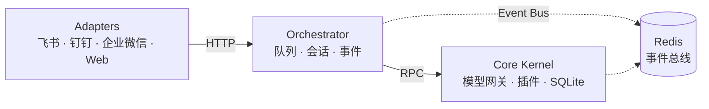

<div align="center">


# Nexus Lark Mind

**个人自用、高解耦、分层清晰的现代化 AI Agent 编排平台。**

[English](README.md) | **简体中文**

[](https://github.com/Dthurt/Nexus_lark_mind)
[](LICENSE)
[](https://github.com/Dthurt/Nexus_lark_mind/stargazers)
[](https://www.python.org/)
[](https://react.dev/)
[](https://fastapi.tiangolo.com/)
[](https://redis.io/)

</div>

## 特性

- ✅ 多渠道适配 — 飞书 / 钉钉 / 企业微信 / Web SSE 对话页
- ✅ 分层架构 — Adapters → Orchestrator → Core Kernel（仅 Kernel 读写 SQLite）
- ✅ 插件运行时 — CLI 脚本、MCP 配置、RPC 加载/卸载/调用
- ✅ React 工作台 — 主题、Canvas 侧栏、工具视图、工作区绑定（本机 + SSH）
- ✅ Docker 或本地开发 — memory broker 快速迭代，无需 Redis

## 目录

- [架构一览](#架构一览)
- [两种启动方式怎么选](#两种启动方式怎么选)
- [Docker 部署](#docker-部署推荐生产--windows-docker-desktop)
- [挂载本地代码目录](#挂载本地代码目录agent-才能读写你的项目)
- [配置](#配置)
- [插件](#插件)
- [本地开发](#本地开发不经-docker)
- [前端（React）](#前端react)
- [测试](#测试)
- [目录结构](#目录)
- [开源许可](#开源许可)

---

## 架构一览



| 进程 | 端口 | 职责 |
|------|------|------|
| `adapters` | 8000 | IM webhook（飞书 / 钉钉 / 企业微信）+ Web SSE 对话页 |
| `orchestrator` | 8002 | 任务队列、会话缓存、内核 RPC 调度、事件转发 |
| `core-kernel` | 8001 | 模型网关、插件运行时、**唯一** SQLite 读写 |
| `redis` | 6379 | 任务队列 + 全局事件总线 |

依赖单向：Adapters → Orchestrator → Kernel → Infrastructure。

> [!NOTE]
> **只有 Core Kernel 可以读写 SQLite**；其他服务一律经 HTTP RPC。

---

## 两种启动方式怎么选

| 方式 | 适用 | 说明 |
|------|------|------|
| **`./nlm` / `nlm.cmd` / `nlm start`** | **推荐本机一键** | Rich TUI（Windows + Linux）：环境检查、依赖安装、模型配置、Crawl4AI、启动与自动修复 |
| `scripts/start_local.bat` | Windows 无菜单轻量启动 | 三服务 + memory broker，**不需要 Docker / Redis**，UI 为 `web-static` |
| `scripts/dev.bat` | **改前端** | 后端 + Vite HMR（打开 :5173） |
| `docker compose` | 联调 / 服务器 / Docker Desktop 部署 | 4 个容器（redis + kernel + orchestrator + adapters） |

---

## Docker 部署（推荐生产 / Windows Docker Desktop）

### 1. 准备

```bash
# 克隆后进入仓库根目录
cp .env.example .env
# 编辑 .env：至少填一个模型密钥（OPENAI_ / DEEPSEEK_ / GLM_ / ANTHROPIC_）
mkdir -p data logs plugins_volume workspaces
```

Windows PowerShell：

```powershell
Copy-Item .env.example .env
New-Item -ItemType Directory -Force data, logs, plugins_volume, workspaces | Out-Null
```

### 2. 镜像与 Compose 文件

| 文件 | 作用 |
|------|------|
| `Dockerfile` | 默认多阶段镜像：Node 构建 React → Python 运行时（**不含** Playwright） |
| `Dockerfile.crawl` | 含 Crawl4AI + Chromium 的更大镜像 |
| `docker-compose.yml` | **主栈**：`redis` + `core-kernel` + `orchestrator` + `adapters`（共 4 服务） |
| `docker-compose.dev.yml` | 开发叠加：挂载 `./src` 便于改代码 |
| `docker-compose.crawl.yml` | 叠加切换 crawl 镜像 |

**容器总量（默认）：4 个**（`nlm-redis` / `nlm-core-kernel` / `nlm-orchestrator` / `nlm-adapters`）。

启用 crawl 叠加后仍是 4 个服务，只是 kernel/adapters 使用更大镜像。

### 3. 启动

```bash
# 标准（Docker Desktop / Linux 相同命令）
docker compose up --build -d

# 需要网页抓取（Crawl4AI）
docker compose -f docker-compose.yml -f docker-compose.crawl.yml up --build -d

# 开发：源码热挂载
docker compose -f docker-compose.yml -f docker-compose.dev.yml up --build
```

启动后：

- Web：http://localhost:8000
- Kernel：http://localhost:8001/health
- Orchestrator：http://localhost:8002/health

> [!TIP]
> 未配置模型密钥时进入 **demo mode**（回声回复），保证 compose 可直接跑通。

常用运维：

```bash
docker compose ps
docker compose logs -f adapters
docker compose down          # 停服务（保留 data/ 与 named volume）
docker compose down -v       # 连 redis volume 一起删（慎用）
```

---

## 挂载本地代码目录（Agent 才能读写你的项目）

容器内的 Agent **看不到**宿主机盘符，必须把本机项目目录挂进 `core-kernel`。

Compose 已配置：

```yaml
# core-kernel
volumes:
  - ${NLM_HOST_WORKSPACE:-./workspaces}:/workspaces:rw
```

即：宿主机目录 → 容器内 **`/workspaces`**。

### 在 `.env` 里指定宿主机路径

```env
# Linux / macOS
NLM_HOST_WORKSPACE=/home/you/projects

# Windows Docker Desktop（推荐正斜杠）
NLM_HOST_WORKSPACE=E:/cursor/open_program
# 或
NLM_HOST_WORKSPACE=C:/Users/you/code
```

改完后重建/重启：

```bash
docker compose up -d
```

### Windows Docker Desktop 注意点

1. 安装并打开 **Docker Desktop**，确认引擎在跑（托盘图标）。
2. **Settings → Resources → File sharing**：把项目所在盘（如 `E:`、`C:`）加入共享；WSL2 backend 一般可直接访问已挂载盘。
3. 路径写成 `E:/foo/bar`（正斜杠），不要用 `E:\foo\bar` 或未共享的盘符。
4. 在 Web 里添加工作区时，填 **容器内路径**，例如：
   - 宿主机 `E:/cursor/open_program/myapp`
   - 且 `NLM_HOST_WORKSPACE=E:/cursor/open_program`
   - 则工作区路径填：`/workspaces/myapp`
5. 侧栏「工作目录」→ 浏览/绑定 → 新开对话后 Agent 的 `read_file` / `edit_file` / `run_shell` 才会落在该目录。

### Linux 示例

```bash
# .env
NLM_HOST_WORKSPACE=/home/you/dev

docker compose up --build -d
# Web 中工作区路径：/workspaces/my-repo
```

### 本机非 Docker 启动

`scripts\start_local.bat` 跑在宿主机进程上，**不需要**挂载；工作区直接填本机绝对路径即可，例如 `E:\cursor\open_program\myapp`。

---

## 配置

编辑 `.env`（模板见 `.env.example`）：

- 模型：`OPENAI_API_KEY` / `DEEPSEEK_API_KEY` / `GLM_API_KEY` / `ANTHROPIC_API_KEY`
- 飞书：`FEISHU_APP_ID` / `FEISHU_APP_SECRET` / …
- 钉钉：`DINGTALK_CLIENT_ID` / `DINGTALK_CLIENT_SECRET` / …
- 企业微信：`WECOM_CORP_ID` / `WECOM_AGENT_ID` / `WECOM_SECRET` / …
- 压缩策略：`COMPACTION_AGGRESSIVENESS=conservative|balanced|aggressive`
- 工作区挂载：`NLM_HOST_WORKSPACE=...`

详见 [docs/architecture.md](docs/architecture.md)、[docs/workspaces.md](docs/workspaces.md)、[docs/interaction-modes.md](docs/interaction-modes.md)、[docs/canvas.md](docs/canvas.md)、[docs/context-and-diff.md](docs/context-and-diff.md)、[docs/diagrams.md](docs/diagrams.md)、[docs/client-architecture.md](docs/client-architecture.md)。

## 插件

- CLI：放入 `plugins_volume/cli/`（`.py` / `.sh` / `.js` / `.ps1`）
- MCP：`plugins_volume/mcp/*.json`
- RPC：`POST /rpc/plugins/load|unload|enable|disable|invoke`

## 本地开发（不经 Docker）

推荐一键（内存总线，无需 Redis；含安装 / 配置向导）：

```bash
# Linux / macOS
chmod +x nlm && ./nlm start

# Windows
nlm start
```

也可用：`./nlm` · `nlm status` · `nlm stop` · `nlm repair`

轻量无菜单（Windows）：

```bat
scripts\start_local.bat
scripts\start_local.bat status
scripts\start_local.bat stop
```

**改 React UI** 请用调试脚本（Vite `:5173` 热更新，API 仍走 `:8000`）：

```bat
scripts\dev.bat
```

构建静态前端（供 `:8000` / Docker）：

```bat
scripts\build_web.bat
```

完整说明：[docs/local-start.md](docs/local-start.md)。

分别启动三进程（需本机 Redis）：

```bash
python -m src.entry_kernel
python -m src.entry_orchestrator
python -m src.entry_adapters
```

## 前端（React）

```bash
cd web
npm install
npm run dev      # Vite :5173，代理 /api → :8000（推荐用 scripts\dev.bat 连后端）
npm run build    # 输出到 ../web-static
npm test
```

主题：`day` / `gray` / `night` / `ocean` / `rose`（Topbar 循环，localStorage `nlm-theme`）。

工作台旁侧 **Canvas**（Chat∥Canvas、图表编辑、Agent `open_canvas`）：见 [docs/canvas.md](docs/canvas.md)。工具卡 / Canvas 视图扩展说明在 `web/docs/`。

## 测试

```bash
pytest -q
cd web && npm test
```

可选网页抓取：

```bash
pip install -r requirements-crawl.txt
crawl4ai-setup
```

CI：`.github/workflows/ci.yml`、`.github/workflows/docker-image.yml`（GHCR）。

## 目录

严格按分层放置，禁止跨层反向依赖。完整说明见 [`docs/`](docs/)（[索引](docs/README.md)）。

## 开源许可

本项目采用 [Apache License 2.0](LICENSE) 开源协议发布。
