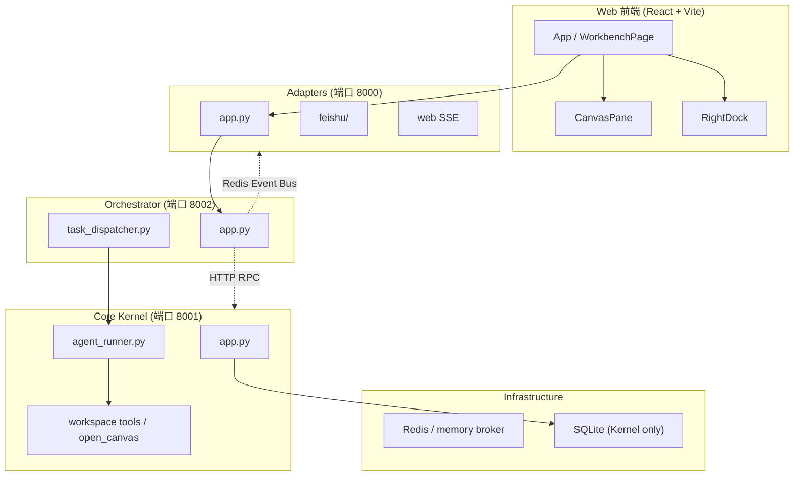

# Nexus-Lark-Mind 架构图（速览）

详细文字说明见 [docs/architecture.md](docs/architecture.md)。工作台 / Canvas 见 [docs/client-architecture.md](docs/client-architecture.md)、[docs/canvas.md](docs/canvas.md)。

> 前端已为 **React**（`web/`），下图中旧 Vue 命名仅作历史示意；进程分层仍准确。

## 架构概览

| 层级 | 服务 | 端口 | 职责 |
|------|------|------|------|
| **Adapters** | 飞书/Web 入口 | 8000 | 飞书、Web SSE、会话 REST（含 `/canvas` `/delivery`） |
| **Orchestrator** | 任务编排 | 8002 | 队列、会话缓存、事件转发（含 `task.canvas_open`） |
| **Core Kernel** | 核心引擎 | 8001 | 模型网关、插件、`open_canvas`、SQLite |
| **Infrastructure** | 基础设施 | - | Redis / memory broker、存储 |

## 关键设计

- **单向依赖**：Adapters → Orchestrator → Kernel → Infrastructure
- **唯一数据源**：只有 Core Kernel 可读写 SQLite，其他通过 HTTP RPC
- **事件总线**：Redis（或 memory）连接各服务
- **插件系统**：CLI、MCP、RPC + 前端 Cordis-lite 槽位（工具卡 / Canvas 视图）
