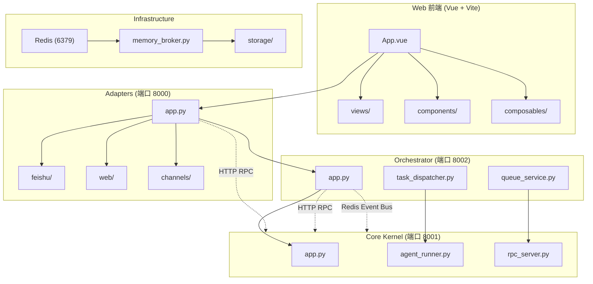

# Nexus-Lark-Mind 架构图

## 架构概览

| 层级 | 服务 | 端口 | 职责 |
|------|------|------|------|
| **Adapters** | 飞书/Web 入口 | 8000 | 飞书 webhook、Web SSE 对话页 |
| **Orchestrator** | 任务编排 | 8002 | 队列、会话、事件转发 |
| **Core Kernel** | 核心引擎 | 8001 | 模型网关、插件运行时、SQLite |
| **Infrastructure** | 基础设施 | - | Redis、内存代理、存储 |

## 关键设计

- **单向依赖**：Adapters → Orchestrator → Kernel → Infrastructure
- **唯一数据源**：只有 Core Kernel 可读写 SQLite，其他通过 HTTP RPC
- **事件总线**：Redis 作为全局事件总线连接各服务
- **插件系统**：支持 CLI、MCP、RPC 插件，自动注册
