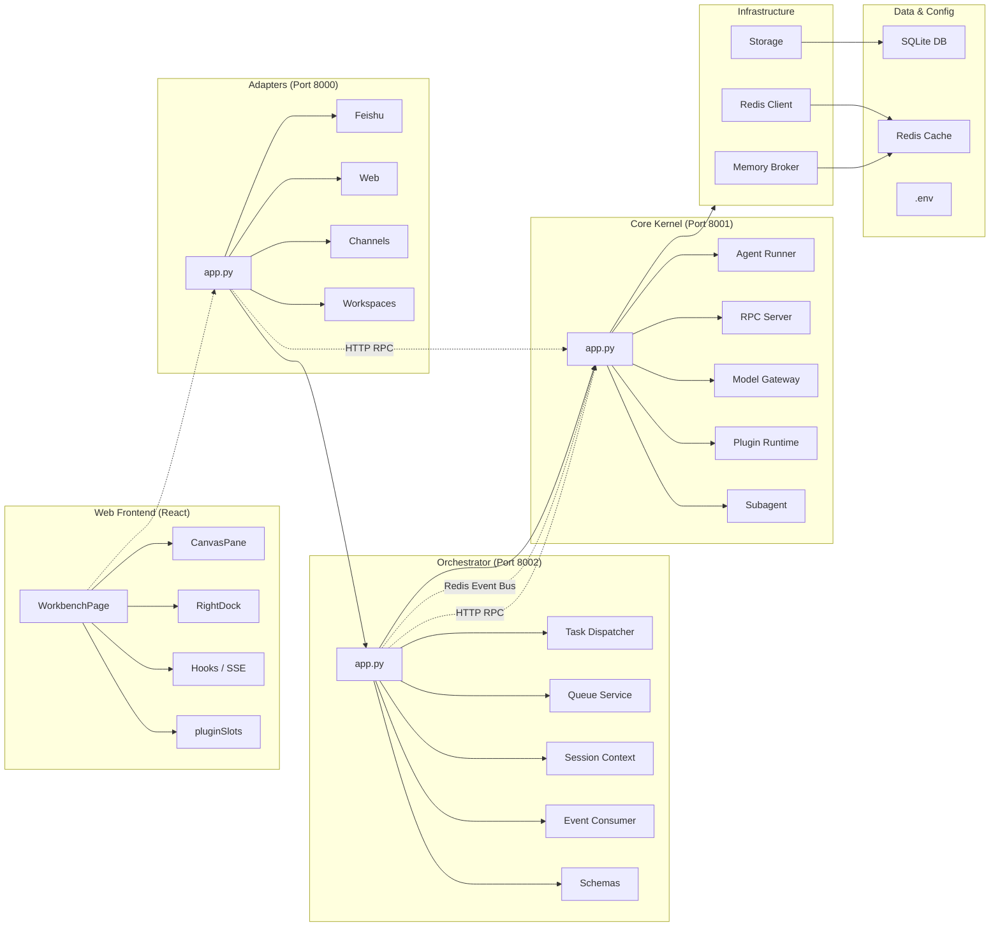

# Nexus-Lark-Mind 架构说明

## 1. 设计目标

- **分层解耦**：Adapters / Orchestrator / Core Kernel / Infrastructure 职责清晰
- **单向依赖**：外层依赖内层，禁止反向 import
- **模型抽象**：业务只认统一 `ModelRequest` / `ModelChunk` / `ModelResponse`
- **插件热插拔**：MCP-Stdio、MCP-HTTP、本地 CLI 统一生命周期
- **单镜像多进程**：一个 Dockerfile，Compose 用不同 CMD 启动三服务 + Redis

## 2. 进程与通信

```
┌────────────┐   enqueue    ┌──────────────┐   HTTP RPC    ┌─────────────┐
│  Adapters  │ ───────────► │ Orchestrator │ ────────────► │ Core Kernel │
│ Feishu/Web │              │ queue/dispatch│              │ model+plugin│
└─────▲──────┘              └──────┬───────┘              └──────▲──────┘
      │                            │ publish                       │
      │         Redis Pub/Sub      ▼                               │
      └──────────── subscribe ──── Event Bus                       │
                                                                   │
                                                         SQLite (only here)
```

### 2.1 Adapters（`:8000`）

- 飞书：事件验签、加密解密、消息/卡片解析、流式卡片增量更新、按钮交互、可选长连接
- Web：`POST /api/chat` 入队 + `GET /api/chat/stream` SSE 订阅会话事件
- 将外部差异全部收敛为 `StandardTask`

### 2.2 Orchestrator（`:8002`）

- Redis List 任务队列（`LPUSH` / `BRPOP`）
- 会话上下文缓存在 Redis（不碰 SQLite）
- 消费队列 → 调 Kernel `/rpc/chat/stream|run` → 把 delta/完成事件发到 Redis channel
- **不实现**模型与插件逻辑

### 2.3 Core Kernel（`:8001`）

- **Model Gateway**：OpenAI 兼容（OpenAI/DeepSeek）、Anthropic；统一重试/熔断/审计入库
- **Plugin Runtime**：`init → ready → invoke → teardown`；故障隔离与自愈
- **Storage**：SQLAlchemy + SQLite，自动 `create_all`
- 对外仅暴露 HTTP RPC

### 2.4 Infrastructure

- `RedisClient`：队列、Pub/Sub、session cache
- `storage/*`：仅 Kernel 引用写路径

## 3. 标准数据模型

核心类型在 `src/common/schemas.py`：

- `StandardTask` — 接入层输出
- `BusEvent` / `StreamDelta` — 事件总线
- `ModelRequest` / `ModelChunk` / `ModelResponse` — 模型归一化
- `PluginInvokeRequest` / `PluginInvokeResult` — 插件调用

## 4. 飞书能力映射

| 能力 | 实现位置 |
|------|----------|
| 验签 / challenge | `adapters/feishu/crypto.py` + webhook |
| 消息解析 | `adapters/feishu/events.py` |
| 流式卡片更新 | Card JSON 2.0 `cards.py` + 防抖 `update_message_card`（同一条消息） |
| 按钮交互 | schema 2.0 `behaviors.callback` → `parse_card_action` / HITL resolve / retry·clear |
| 长连接 | `long_connection.py`（凭证齐全时启用） |

## 5. 扩展新模型

1. 实现 `BaseModelProvider`
2. 在 `ProviderRegistry._register_defaults` 或运行时 `register()`
3. 业务侧只改 `provider` 字段，无需改 Orchestrator / Adapters

## 6. 扩展新插件

### CLI 自动注册

把可执行脚本放入 `plugins_volume/cli/`，文件名即工具名。stdin 接收 JSON。

### MCP 清单示例

```json
{
  "plugin_id": "mcp.my_tool",
  "name": "My Tool",
  "kind": "mcp_stdio",
  "enabled": true,
  "config": {
    "command": "python",
    "args": ["-m", "my_mcp_server"]
  }
}
```

## 7. 数据库表

- `tasks` — 任务生命周期
- `sessions` — 会话消息持久化
- `plugin_calls` — 插件调用审计
- `model_calls` — 模型调用审计
- `system_logs` — 系统日志（可扩展）

## 8. 安全边界

- 密钥仅存环境变量 / `.env`（勿提交）
- 飞书 encrypt_key 用于签名与事件解密
- 插件默认隔离：单插件崩溃触发 ERROR + 后台 heal，不拖垮内核

## 9. 本地端口与健康检查

| URL | 含义 |
|-----|------|
| `GET /health` on 8000/8001/8002 | 进程存活 |
| `GET /rpc/providers` | 已注册模型厂商 |
| `GET /rpc/plugins` | 插件列表与状态 |

---

## 9.1 工作台 Canvas（旁侧产物）

Web 中栏支持 Chat∥Canvas 分栏：会话级多 tab 文档、编辑器、Agent 工具 `open_canvas`、可选落盘 `.nlm/canvases/`。

| 层 | 职责 |
|----|------|
| Kernel | `open_canvas` 工具；返回 body/path；chunk `canvas_open` |
| Orchestrator | `EventType.TASK_CANVAS_OPEN` → SSE |
| Adapters | `POST /api/sessions/{id}/canvas`；透传 SSE |
| Web | `useChatStream` → `nlm-canvas-open` → `CanvasPane` |

完整说明：[canvas.md](./canvas.md)、[client-architecture.md](./client-architecture.md)。

---

## 10. 架构图



---

## 相关文档

- [README（文档索引）](./README.md)
- [client-architecture.md](./client-architecture.md) — React 工作台
- [canvas.md](./canvas.md) — 旁侧 Canvas
- [diagrams.md](./diagrams.md) — 聊天内图表
- [workspaces.md](./workspaces.md) — 工作区与 `.nlm/`
- [plugins.md](./plugins.md) — 插件与前端槽位
- [deferred.md](./deferred.md) — 已完成 / 仍延期
