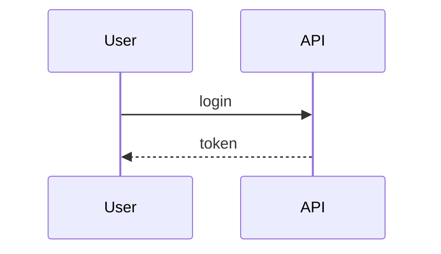

# Diagrams in chat (Mermaid, ECharts & Draw.io)

The workbench renders fenced diagrams **inside assistant messages**. For a durable, editable side pane (tabs, Agent open, disk persist), see **[canvas.md](./canvas.md)**.

Agent guidance lives in the kernel system prompt (`## Diagrams, charts & math`): the model **chooses** Mermaid vs Draw.io by complexity, and may call `open_canvas` for lasting reference.

---

## Formats

| Fence | When to use | Engine |
|-------|-------------|--------|
| ` ```mermaid ` | Default: flows, sequences, ER, state, mind maps | Local Mermaid v11 |
| ` ```echarts ` / ` ```echart ` | Stats (line/bar/pie/scatter/…) | Local ECharts; body = **one JSON option object** (not JS) |
| ` ```drawio ` / ` ```diagrams ` / ` ```mxfile ` | Precise layout, swimlanes, richer boards | Offline SVG preview by default; optional local `/drawio/` or remote diagrams.net |
| ` ```xml ` | Only if body is `<mxfile>` / `<mxGraphModel>` | Same as Draw.io |

---

## Mermaid

- Sanitized locally (broken arrows like `-. -->` → `-.->`).
- Optional `/api/mermaid/repair` model rewrite on parse failure.
- Toolbar: fold, copy, download SVG/PNG, fullscreen (pan + zoom), view/source, **Canvas**.

Example:

````markdown

````

---

## ECharts

- Fence body must be valid ECharts **option JSON** (not JavaScript).
- Heuristic repair: bare JSON / ```json that looks like an option may be normalized to ```echarts.
- Toolbar: fold, copy JSON, download PNG, fullscreen, canvas zoom, retry, view/source, **Canvas**.

Example:

````markdown
```echarts
{
  "xAxis": { "type": "category", "data": ["Mon", "Tue", "Wed"] },
  "yAxis": { "type": "value" },
  "series": [{ "type": "bar", "data": [12, 20, 8] }]
}
```
````

Large datasets: aggregate with `run_code` / a short script; do not dump huge tables into the model context.

---

## Draw.io XML

Example:

````markdown
```drawio
<mxfile host="app.diagrams.net">
  <diagram name="Page-1">
    <mxGraphModel>
      <root>
        <mxCell id="0"/>
        <mxCell id="1" parent="0"/>
        <mxCell id="2" value="Hello" style="rounded=1;whiteSpace=wrap;html=1;" vertex="1" parent="1">
          <mxGeometry x="120" y="120" width="120" height="60" as="geometry"/>
        </mxCell>
      </root>
    </mxGraphModel>
  </diagram>
</mxfile>
```
````

- Toolbar: fold, copy XML, open in diagrams.net, fullscreen, view/source, **Canvas**.
- **Offline**: built-in mxCell → SVG preview (no CDN). Drop a diagrams.net embed build into `web/public/drawio/` for a full local viewer, or set `localStorage.nlm_drawio_embed` to a custom embed URL.
- **Fast** experience tier: Draw.io fences render as blocked source (Mermaid only). See [experience-tiers.md](./experience-tiers.md).

---

## Opening in Canvas

Every diagram toolbar exposes **Canvas**:

1. Dispatches `nlm-canvas-open` with `kind` + `body`.
2. Workbench opens Chat∥Canvas and shows the matching editor.
3. Edits **应用** write back to the session Canvas store; **保存** can write `{cwd}/.nlm/canvases/`.

Agent path: tool `open_canvas` → SSE `task.canvas_open` → same UI event.

Full reference: [canvas.md](./canvas.md).

---

## Implementation map

| Area | Path |
|------|------|
| Markdown fences → HTML hosts | `web/src/lib/markdown/render.ts` |
| Mermaid render / repair | `render.ts` + `/api/mermaid/repair` |
| ECharts | `web/src/lib/markdown/echarts.ts` |
| Draw.io | `web/src/lib/markdown/drawio.ts` |
| Theme (panel bg / light) | `web/src/lib/markdown/diagramTheme.ts` |
| Local draw.io bundle notes | `web/public/drawio/README.md` |

---

## Related

- [canvas.md](./canvas.md) — side pane editors, Agent, disk, plugins  
- [experience-tiers.md](./experience-tiers.md) — Mermaid ↔ Draw.io gate  
- [interaction-modes.md](./interaction-modes.md) — Delivery extracts diagram fences  
- [deferred.md](./deferred.md)  
- [plugins.md](./plugins.md)  
